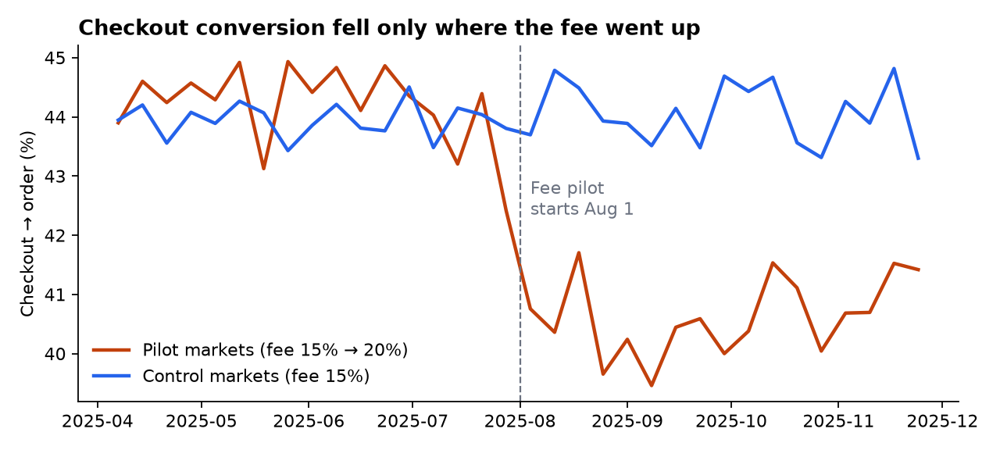

# Sellthrough

**Did a higher buyer fee pay for itself?** An end-to-end analytics project for a live-event ticket marketplace: a synthetic data source, dbt models with tests, Looker-ready semantic definitions, and a stakeholder memo that answers a pricing question.

> **Answer:** keep the 20% fee on weekend events (net revenue +15.7%, GMV flat). Roll it back on weeknights, where it cut tickets sold by 15.6% and GMV by 12% with no reliable revenue gain. A local team's slump makes the fee look about 50% worse than it is unless you separate it out. **[Read the memo →](reports/memo.md)**



## The business question

On Aug 1, 2025, the marketplace raised its buyer service fee from 15% to 20% in three pilot markets. Two months later, sell-through in those markets was down. Pricing leads want to know:

1. How much of the drop did the fee cause?
2. Did the extra fee revenue make up for the lost sales?
3. Should we keep it, change it or roll it out?

## What's in the repo

| Layer | What it does | Where |
|---|---|---|
| Source data | Generates 2,139 events, 408K listings, 247K orders and 72K daily funnel rows across 8 markets for 2025 | [`generator/generate.py`](generator/generate.py) |
| Staging | One clean view per source table: renames, types, derived flags | [`models/staging/`](models/staging) |
| Intermediate | Joins events to performer, venue, market and team form; applies the fee schedule to each order | [`models/intermediate/`](models/intermediate) |
| Marts | `fct_event_performance`, `fct_orders`, `fct_listings`, `fct_market_daily`, `fct_buyer_cohorts`, `dim_events`, `dim_markets` | [`models/marts/`](models/marts) |
| Tests | 39 dbt tests: keys, relationships, accepted values, plus custom checks that sold ≤ listed, the fee charged matches the fee schedule, and orders reconcile to source | [`models/marts/_marts.yml`](models/marts/_marts.yml), [`tests/`](tests) |
| Semantic layer | LookML views and explores with metric definitions | [`lookml/`](lookml) |
| Analysis | Difference-in-differences with fixed effects and bootstrap intervals | [`analyses/fee_pilot_readout.py`](analyses/fee_pilot_readout.py) |
| Dashboard | Mart extracts and a step-by-step Looker Studio build | [`exports/`](exports), [`docs/looker_studio.md`](docs/looker_studio.md) |
| Readout | One-page stakeholder memo | [`reports/memo.md`](reports/memo.md) |

## Metric definitions

| Metric | Definition | Why it matters |
|---|---|---|
| Sell-through | Tickets sold ÷ tickets listed | Marketplace liquidity: are listings finding buyers? |
| Session → checkout | Checkout starts ÷ event-page sessions | Demand and interest. Moves when fans care more or less about the event. |
| Checkout → order | Orders ÷ checkout starts | Price acceptance. Moves when the all-in price changes, because fees appear at checkout. |
| GMV | Ticket subtotal + buyer fee (completed orders) | What fans spend |
| Net revenue | Buyer fee + seller fee (completed orders) | What the marketplace keeps |
| Take rate | Net revenue ÷ ticket subtotal | Monetization per dollar of tickets |

Splitting the funnel into these two steps is what separates the two drivers in this data. A fee change moves checkout conversion. A demand shock, like a team slump, moves sessions.

## Run it

Requires Python 3.11+.

```bash
make setup   # create .venv and install dbt-duckdb, pandas, matplotlib
make all     # generate data -> dbt build (models + tests) -> analysis, charts, CSV exports
```

Explore the warehouse directly:

```bash
.venv/bin/python -c "import duckdb; print(duckdb.connect('warehouse.duckdb').sql('select market_name, round(sum(tickets_sold)/sum(tickets_listed),3) sell_through from fct_event_performance group by 1 order by 2'))"
```

## About the data

All data is **synthetic**. Markets are real US cities, but every team, artist, show and number is invented. The generator plants two effects, and both can be found in the data:

- **A fee pilot.** The `fee_schedule` table shows the 20% buyer fee in three markets from Aug 1. The simulation makes weeknight and low-price buyers more fee-sensitive.
- **A team slump.** The `team_games` table shows the Phoenix baseball team winning about 24% of games after Aug 1, which lowers demand for its home games.

Because both effects are planted, the analysis can be checked against a known answer. That's something real data never allows, and it's why this project uses synthetic data.

The LookML in `lookml/` follows standard Looker syntax but hasn't been validated against a live Looker instance.
