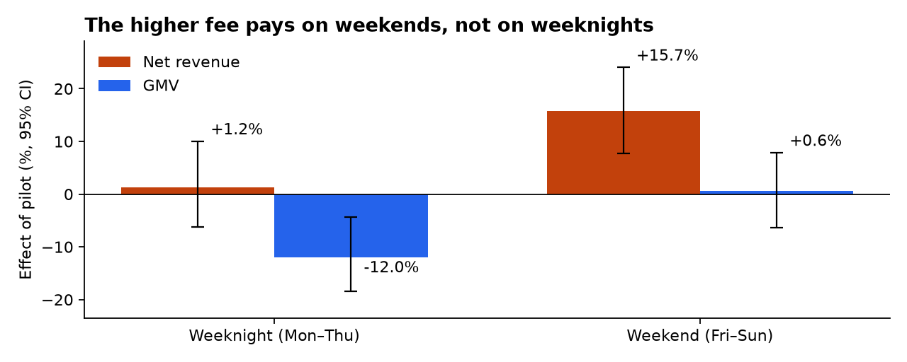
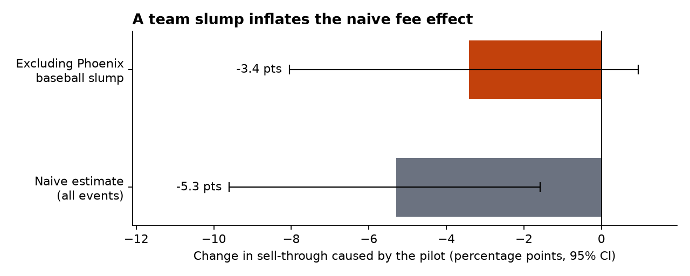

# Buyer fee pilot readout: keep it on weekends, roll it back on weeknights

**To:** Marketplace pricing leads · **From:** Data team · **Data through:** Sep 30, 2025 events
**Data:** synthetic marketplace built for this portfolio project (see [README](../README.md))

## Recommendation

On Aug 1 we raised the buyer service fee from 15% to 20% in Phoenix, Nashville and Columbus. Five other markets kept 15% and serve as the comparison group.

1. **Keep the 20% fee for Friday–Sunday events.** Net revenue per listed ticket rose **+15.7%** (95% CI +7.7% to +24.0%). Fans bought only 3.6% fewer tickets, and GMV was flat.
2. **Return Monday–Thursday events to 15%.** Weeknight tickets sold fell **15.6%** and GMV fell **12.0%** (CI −18.5% to −4.3%). Revenue showed no reliable gain (+1.2%, CI −6.2% to +10.0%). The higher fee cost fans and sellers without earning anything back.
3. **Extend the weekend fee to two control markets before a national rollout.** Three pilot markets is a small sample, so a staggered rollout would confirm the weekend result.

## What happened

**Buyers abandon at checkout, where they first see the fee.** In pilot markets, the share of checkouts that became orders fell **3.6 points** relative to control (CI 2.9 to 4.5 points). The step before it, sessions to checkout, didn't move (+0.02 points). Fans still arrive and pick seats. The fee is what loses them.

**Weeknight buyers are more price-sensitive.** Weeknight sell-through fell **8.7 points** (CI 4.3 to 13.1). On weekends the drop was 2.3 points, which is within noise (CI −7.1 to +2.0).

## A trap in the headline number

A straight pilot-vs-control comparison says the fee cut sell-through by **5.3 points**. About a third of that isn't the fee.

The Phoenix Scorpions collapsed in August: their last-10-game win rate fell from **.610 to .319**, and sessions per home game fell **14%**. That's lost demand, which shows up as fewer visitors, not lower checkout conversion. Because Phoenix is a pilot market, the slump lands in the pilot group. Excluding Phoenix baseball, the fee effect across all events is **−3.4 points** (CI −8.1 to +1.0).

## How this was measured

- **Comparison:** difference-in-differences on 637 events. Events from Jun 1–Jul 25 are compared with events from Aug 8–Sep 30, pilot markets against control markets. The gap around Aug 1 keeps events whose sales straddle the change out of both windows. Estimates use category and market fixed effects, weighted by tickets listed, with 95% intervals from 1,000 bootstrap resamples of events.
- **Revenue and GMV** are derived as sell-through × price × take rate rather than compared in dollars directly, because the events on sale differ between windows. Sellers didn't reprice in response: median price-to-face moved −2.0% in pilot markets and −3.2% in control.
- **Limits:** with only three pilot markets, the intervals assume events are independent. Grouping by market would widen them, which is one more reason for the staggered rollout. The analysis covers seven weeks after the change and can't show long-run effects such as fans switching platforms.

All figures come from `analyses/fee_pilot_readout.py` and are stored in [`findings.json`](findings.json).

## Checking against the planted answer

The data is synthetic, so the true fee effect is known: the generator records whether each listing would have sold without the fee ([`data/planted_effects.json`](../data/planted_effects.json)). The analysis never reads that file. [`analyses/check_against_truth.py`](../analyses/check_against_truth.py) compares the two, and CI fails if any 95% interval misses the truth.

| Sell-through effect | True | Estimated | 95% CI |
|---|---|---|---|
| All events, excl. Phoenix baseball | −3.8 pts | −3.4 pts | −8.1 to +0.9 |
| Weekend | −2.7 pts | −2.3 pts | −7.1 to +2.0 |
| Weeknight | −6.3 pts | −8.7 pts | −13.1 to −4.2 |

All three intervals contain the truth. The weeknight estimate overshoots, though: the true effect implies tickets sold fell about 12% and GMV about 8%, not 15.6% and 12%. The recommendation doesn't change, since weeknight GMV still falls and revenue gains stay small. It's a reminder that the weeknight numbers are the less precise ones.
